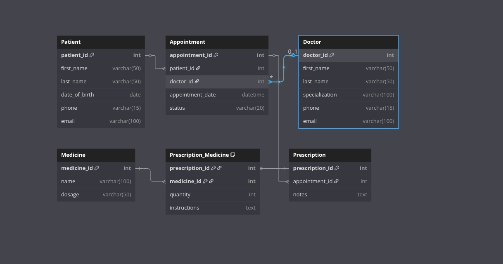

# 🏥 Clinic Booking System

## 📘 Project Description

The **Clinic Booking System** is a relational database built entirely in MySQL that enables the management of patients, doctors, appointments, prescriptions, and medicines. It is designed to support clinics and small healthcare providers in efficiently organizing bookings, tracking medical treatments, and recording prescription history.

The system captures:

- Patient records and contact information
- Doctor profiles and their specializations
- Appointment scheduling between patients and doctors
- Prescription assignment per appointment
- Medicine management with dosage tracking

The database follows best practices in relational modeling, including normalization (up to 3NF), foreign key constraints, and appropriate indexing.

---

## ⚙️ How to Setup / Run the Project

To run this project, you shall need a MySQL server. Follow these steps:

### 📦 Prerequisites

- MySQL Server (version 5.7 or above)
- MySQL Workbench or any MySQL-compatible client

### 🚀 Steps

1. **Clone or Download the SQL File**  
   Download the `clinic_booking_system.sql` file containing all `CREATE TABLE` statements.

2. **Open MySQL Workbench**

3. **Create a New Database**

   ```sql
   CREATE DATABASE ClinicDB;
   USE ClinicDB;
   ```

4. **Import the SQL Script**
   Run the SQL file using:
   File > Open SQL Script > Select `clinic_booking_system.sql`

5. Verify Tables
   Use the command below to see all tables:
   `SHOW TABLES;`

### Entity Relationship Diagram


